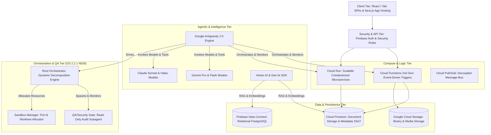
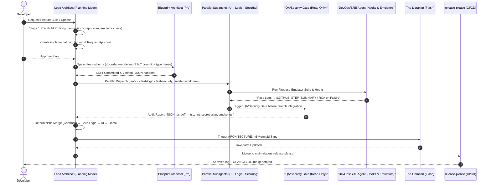
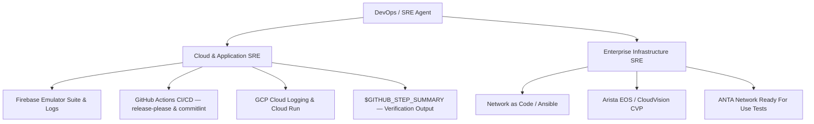
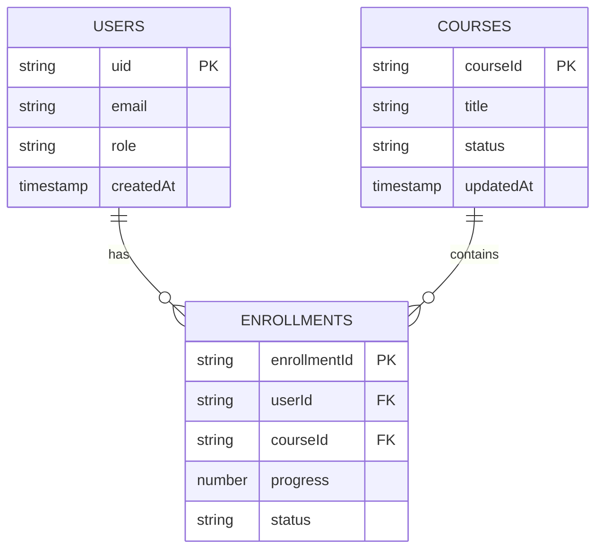
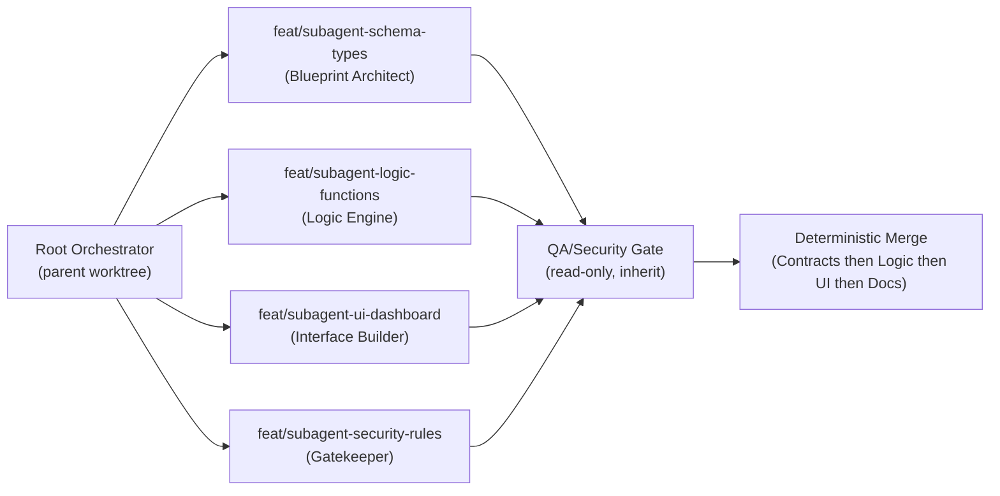

# Agentic Engineering Standard (OS 2.2) - Master Architectural & Software Design Manual

*Standard Operating Specification for Google Antigravity, Firebase, Google Cloud Platform, Gemini & Claude Agentic Engineering*

> **Supersedes**: `PARALLEL_ORCHESTRATION_WORKFLOW_OS_2.1.md` (archived as `.deprecated`)
> **Effective**: 2026-08-30 | **Version**: OS 2.2.1 | **Status**: `ACTIVE`
> **Amendment**: Dynamic Subagent Orchestration & Execution Standards added 2026-08-31

---

## 1. Executive Architecture & Portfolio Software Hygiene

This Master Architectural Manual defines the mandatory software design rules, operational workflows, and security guardrails for building and maintaining enterprise applications across the portfolio (*Academy Library*, *Academy Timeliner*, *Academy Builder*, *Academy Insight*, and future systems).

It establishes the **Agentic Engineering Standard (OS 2.2)** built on **Google Antigravity (AGY)** with **Gemini & Claude Agents**, transforming software development into a self-healing, event-driven, empirically-verified engineering assembly line with deterministic release hygiene.

---

### 1.1 The 7 Core Pillars of Software Hygiene

Every subagent, every PR, and every deployed artifact is bound by these seven non-negotiable pillars:

| # | Pillar | Enforcement Mechanism |
| :- | :--- | :--- |
| **1** | **Single Source of Truth (SSoT) Precedence** — Data schemas (`docs/data-model.md`) must be committed *before* consuming code is written. No application code may reference a collection, field, or type not declared in the SSoT. | Blueprint Architect gate; pre-commit hook blocks schema drift |
| **2** | **Empirical Verification Precedence** — No task, PR, or turn is declared complete without concrete, un-truncated runtime test logs or execution evidence. Screenshots or emulator pass logs must be linked in the PR body. | DevOps/SRE Agent; `$GITHUB_STEP_SUMMARY` mandatory output |
| **3** | **Zero-Symptom-Masking** — Exceptions, null payloads, or network failures must **never** be swallowed, caught silently, or replaced with dummy fallback data. Diagnostics must trace upstream root causes. `try/catch` blocks must re-throw or emit structured log entries. | `.agents/rules/software_hygiene.md`; oxlint no-swallowed-errors |
| **4** | **Least-Privilege Security** — IAM roles, Firebase Security Rules, and Secret Manager values are strictly scoped to minimum necessary access. Security rules must be validated against the local Firebase Emulator before any deploy. | The Gatekeeper; `.agents/rules/security_least_priv.md` |
| **5** | **Continuous Visual & Technical Synchronization** — Architectural flowcharts (`ARCHITECTURE.md`) are maintained dynamically via **The Librarian** background agent on every merge to `main`. | `update-docs.yml` GitHub Action; Mermaid.js auto-regeneration |
| **6** | **Domain-Driven Isolation** — Applications are partitioned into bounded contexts with clear schema interfaces. Subagents execute in isolated Git branches (`workspace: "branch"`). Zero direct commits to `main`. | `.agents/rules/data_architecture.md`; branch protection rules |
| **7** | **Deterministic Release Hygiene** — All releases follow SemVer (vX.Y.Z). `CHANGELOG.md` is generated exclusively by `release-please`. Conventional Commits 1.0.0 is mandatory for all commits. Manual edits to `CHANGELOG.md` are strictly prohibited. | `release.yml`; `lint-commits.yml`; `.agents/rules/git_conventions.md` |

---

## 2. Portfolio Technical Architecture & Google Tech Stack Standard



### 2.1 Standardized Technology Stack Matrix

| Layer | Primary Google Product | Operational Guidelines & Best Practices |
| :--- | :--- | :--- |
| **Frontend / Web Apps** | **React + Vite / Next.js (App Hosting)** | Modern Vanilla CSS / HSL tokens, ARIA accessibility, responsive layouts. No generic placeholders. TypeScript strict mode mandatory. |
| **Authentication** | **Firebase Auth** | Anonymous auth for quick starts, OAuth/Custom tokens for elevated administrative operations. |
| **Document Persistence** | **Cloud Firestore** | Hierarchical document modeling, sub-collections for historical audits (`/history`), composite index optimization. All collections declared in SSoT first. |
| **Relational Persistence** | **Firebase Data Connect** | Structured GraphQL / PostgreSQL schema definitions for complex relational domain entities. |
| **Binary Storage** | **Cloud Storage (GCS)** | Direct client uploads via Signed URLs. Automated lifecycle rules (archive blobs after 30 days). |
| **Event Compute** | **Cloud Functions (2nd Gen)** | Idempotent background triggers. Retry-safe design required. Structured error propagation mandatory. |
| **Service Microservices** | **Cloud Run** | Containerized REST / gRPC microservices scaling from 0 to N instances. |
| **Telemetry & Observability** | **Google Cloud Logging** | Structured JSON logging, central log aggregation via `google-cloud-logging` MCP. |
| **Agentic AI & LLMs** | **Google Antigravity + Gemini/Claude** | Multi-agent delegation, model tiering (Pro for reasoning, Flash for execution), tool calling, parallel workstream dispatch. |
| **Orchestration Engine** *(OS 2.2.1 NEW)* | **Antigravity Dynamic Orchestrator** | Runtime role decomposition, Stage 1 pre-flight profiling, isolated worktree dispatch, JSON structured handoffs, deterministic merge ordering. |

---

## 3. Antigravity Customization Framework (`.agents/`)

Every portfolio repository instantiates a standardized `.agents/` configuration directory:

```
.agents/
├── rules/
│   ├── data_architecture.md      # Immutable rules for schema and data models (SSoT)
│   ├── security_least_priv.md    # Firebase Auth & Security least-privilege enforcement
│   ├── frontend_design.md        # UI components & design system standards
│   ├── software_hygiene.md       # Error handling, logging, and empirical test validation
│   ├── git_conventions.md        # Conventional Commits 1.0.0 & release hygiene (OS 2.2 NEW)
│   └── orchestration.md          # Dynamic subagent decomposition & sandbox rules (OS 2.2.1 NEW)
├── skills/
│   ├── firebase-orchestrator/    # SKILL.md for Firebase CLI & Emulator tooling
│   ├── mermaid-architect/        # SKILL.md for Living Blueprint auto-generation
│   └── sre-verifier/             # SKILL.md for CI/CD log inspection & RCA
├── hooks.json                    # Lifecycle hooks: pre-commit emulator + commitlint (OS 2.2 UPDATED)
└── mcp_config.json               # MCP server definitions (Firebase, GitHub, Chrome DevTools, GCP)
```

---

## 4. Programmatic Subagent Registry & Model Tiering

| Subagent Name | Core Mission | Model Tier | Primary MCP & Tool Suites | Workspace Mode |
| :--- | :--- | :--- | :--- | :--- |
| **Blueprint Architect** | Schema design & SSoT maintenance (`docs/data-model.md`). | `Gemini Pro` / `Claude Sonnet` | Firebase MCP, Local FS | `branch` (`feat-schema`) |
| **The Gatekeeper** | Auth & Security expert. Validates all rules against local emulator before deploy. | `Gemini Pro` / `Claude Sonnet` | Firebase Security MCP, Firebase Emulator | `branch` (`feat-security`) |
| **Interface Builder** | Modular frontend development & visual UI verification. | `Gemini Pro` / `Claude Sonnet` | Chrome DevTools MCP, Modern Web Guidance | `branch` (`feat-ui`) |
| **The Logic Engine** | Idempotent Cloud Functions 2nd Gen, API routes, event triggers. | `Gemini Pro` / `Claude Sonnet` | Firebase Cloud MCP, GCP Logging MCP | `branch` (`feat-logic`) |
| **The Librarian** | Living Blueprint synchronization — regenerates Mermaid.js in `ARCHITECTURE.md` on every merge. | `Gemini Flash` / `Claude Haiku` | Mermaid Tool, Git MCP | `share` (`docs-sync`) |
| **DevOps / SRE Agent** | CI/CD management, emulator log analysis, release health, `$GITHUB_STEP_SUMMARY` output. | `Gemini Flash` / `Claude Haiku` | GitHub MCP, Cloud Run MCP, Shell Runner | `share` (`ops-main`) |
| **QA/Security Gate** *(OS 2.2.1 NEW)* | Read-only pre-integration audit: tsc, lint, secret scan, npm audit, headless smoke test. Spawned dynamically every cycle. | `Gemini Pro` / `Claude Sonnet` | Chrome DevTools MCP, Shell Runner | `inherit` (read-only) |
| **Sandbox Manager** *(OS 2.2.1 NEW)* | Allocates deterministic port offsets and worktree boundaries. Enforces file ownership manifests. Prunes ephemeral worktrees post-merge. | `Gemini Flash` / `Claude Haiku` | Shell Runner, Git MCP | `share` (`ops-main`) |

---

## 5. Master Application Workflow — 6-Phase Lifecycle



### Phase 1 — Planning Mode & Task Decomposition
- **Lead Architect** enters Antigravity **Planning Mode**.
- **Stage 1 Pre-Flight Profiling** (mandatory before any subagent spawn):
  - Verify workspace read/write permissions.
  - Scan repository structure for existing SSoT documents, open branches, and stale worktrees.
  - Confirm Firebase Emulator and/or Vite runtime availability on expected ports.
  - Abort and report if any pre-flight check fails — do not proceed to subagent dispatch.
- Generates `PROJECT_CHARTER.md` and `implementation_plan.md` with `request_feedback: true`.
- **Gate**: No code mutations begin without explicit user approval.

### Phase 2 — Structural Data Modeling & SSoT Declaration
- **Blueprint Architect** (`Pro`) establishes `docs/data-model.md`.
- All collection names, document fields, data types declared **before** consumer code exists.
- **Type Freeze**: TypeScript interfaces, API schemas, and data models are committed and locked before implementation subagents are dispatched (see §11.3).

### Phase 3 — Parallelized Build & MCP-Powered Delegation
- **Interface Builder**: Modular UI + Chrome DevTools MCP visual audit; headless `/browser` smoke test required.
- **The Logic Engine**: Idempotent Cloud Functions. Structured error propagation — no swallowed exceptions.
- **The Gatekeeper**: Least-privilege `firestore.rules` tested against local Firebase Emulator.
- All workstream subagents execute in **isolated Git worktrees** (`branch` mode). Sandbox Manager assigns deterministic port offsets.

### Phase 4 — Automated Verification Loop & Software Hygiene
- Pre-commit hooks: emulator suite → lint → commitlint.
- Post-edit: `oxlint --deny-warnings` runs continuously.
- **QA/Security Gate** spawned dynamically before any branch integration (see §11.4).
- All verification output posted to `$GITHUB_STEP_SUMMARY` — never committed as loose `.md` files.

### Phase 5 — Automated Visualization & Living Blueprint Sync
- **The Librarian** (`Flash`) triggers on merge events via `update-docs.yml`.
- Regenerates Mermaid.js ERD and system topology in `ARCHITECTURE.md`.

### Phase 6 — Integration, SemVer Release & Production Deployment
- Deterministic merge order: **Contracts/Models → Core Logic → UI → Documentation**.
- Integration checks run after each sequential merge step.
- `release-please` generates SemVer tags and `CHANGELOG.md` from Conventional Commits.
- Conditional production deployment on `steps.release.outputs.release_created == 'true'`.
- Sandbox Manager prunes all ephemeral worktrees and feature branches post-merge.
- `walkthrough.md` artifact: change summary, emulator pass logs, visual proof screenshots.

---

## 6. Comprehensive DevOps / SRE Agent Profile

### 6.1 Dual-Domain SRE Architecture



### 6.2 Cloud & Application SRE Responsibilities
- **Guardrail & Memory Enforcement**: Monitors CPU/Memory via `manage_task`.
- **Central Log Diagnostics**: Queries GCP Cloud Logging via `google-cloud-logging` MCP.
- **Automated RCA**: Parses un-truncated tracebacks to isolate exact failure points.
- **Step Summary Reporting**: All test results and emulator logs posted to `$GITHUB_STEP_SUMMARY`.

### 6.3 Enterprise Infrastructure SRE (Optional Module)
- **Network as Code (NaC)**: Manages network device state using Ansible (`arista.avd`), Jinja2, and `cvprac`.
- **Fabric Validation**: ANTA test suites for L2/L3 topology health and BGP sessions.
- **Zero Touch Management**: ZTP and PKI/TLS certificate lifecycles.

---

## 7. SRE Metrics, Governance & Reliability Guards

### 7.1 Key Performance Indicators (KPIs)

| Metric | Definition | Target | Mechanism |
| :--- | :--- | :--- | :--- |
| **TTD** | Time from failure to diagnostic alert. | `< 30 seconds` | `manage_task` watcher |
| **TTR** | Time from detection to automated fix dispatch. | Rapid containment | Subagent auto-remediation |
| **Emulator Pass Rate** | % of PRs passing emulator suite before merge. | `100%` mandatory | `hooks.json` pre-commit |
| **Conventional Commit Rate** | % of commits passing `commitlint`. | `100%` mandatory | `lint-commits.yml` + hook |
| **Living Blueprint Sync** | Delay between schema update & `ARCHITECTURE.md` re-sync. | `< 1 min` | The Librarian + `update-docs.yml` |
| **Release Determinism** | % of releases via `release-please` only. | `100%` mandatory | `release.yml` |
| **QA Gate Pass Rate** *(OS 2.2.1 NEW)* | % of branches cleared by QA/Security Gate before integration. | `100%` mandatory | QA/Security Gate subagent |
| **Suppression-Zero Rate** *(OS 2.2.1 NEW)* | Zero `@ts-ignore` / `eslint-disable` suppressions in merged code. | `100%` mandatory | `tsc --noEmit`; oxlint strict |

### 7.2 Crucial Architectural Guards

| Guard | Rule | Enforcement |
| :--- | :--- | :--- |
| **Guard 1** | Zero direct commits to `main`. All agents execute in isolated worktrees. | Branch protection; `git_conventions.md` |
| **Guard 2** | Subagents bound by `.agents/rules/`. Cannot modify files outside domain scope. | `.agents/rules/`; system_prompt constraints |
| **Guard 3** | `docs/data-model.md` committed before consuming application code. | Blueprint Architect gate |
| **Guard 4** | No task complete without `$GITHUB_STEP_SUMMARY` evidence. | DevOps/SRE Agent; CI Step Summary |
| **Guard 5** *(OS 2.2)* | `CHANGELOG.md` generated solely by `release-please`. No manual edits. | `release.yml`; `git_conventions.md` |
| **Guard 6** *(OS 2.2.1 NEW)* | No branch integration without QA/Security Gate clearance. Audit report must be attached as JSON handoff. | QA/Security Gate; `orchestration.md` |
| **Guard 7** *(OS 2.2.1 NEW)* | Concurrent subagents may not mutate shared barrel files, route registries, or config manifests simultaneously. | Sandbox Manager file ownership manifest |
| **Guard 8** *(OS 2.2.1 NEW)* | Subagent recursion capped at depth 2 (Orchestrator → Worker). Tool budget capped at 10 iterations per task. | Orchestrator system prompt; `orchestration.md` |

---

## 8. Living Blueprint Protocol

`ARCHITECTURE.md` is maintained dynamically by **The Librarian** agent using auto-generated Mermaid.js blocks:



Every merge to `main` triggers `update-docs.yml`, ensuring documentation matches the running production state at all times.

---

## 9. Release & Versioning Protocol (OS 2.2 Addition)

### 9.1 SemVer Tagging via `release-please`
- `fix:` → **PATCH** (e.g., `v1.0.1`)
- `feat:` → **MINOR** (e.g., `v1.1.0`)
- `feat!:` or `BREAKING CHANGE:` footer → **MAJOR** (e.g., `v2.0.0`)

### 9.2 CHANGELOG.md Governance
- `CHANGELOG.md` is **read-only for all humans and agents**.
- Generated exclusively by `release-please` on merge to `main`.
- PRs containing manual edits to `CHANGELOG.md` are automatically rejected.

### 9.3 Agent Attribution in Commits
All commits authored by subagents must include:
```
Co-authored-by: <AgentName> <agent@antigravity.internal>
```

---

## 10. Conclusion: The Autonomous Enterprise Ecosystem

**OS 2.2 vs OS 2.1 Key Upgrades:**

| Dimension | OS 2.1 | OS 2.2 |
| :--- | :--- | :--- |
| Release hygiene | Manual | `release-please` SemVer automation |
| Commit standards | Recommended | Mandatory — `commitlint` in `pre-commit` |
| Agent models | Gemini only | Gemini + Claude (tiered) |
| Verification output | Loose `.md` files | `$GITHUB_STEP_SUMMARY` only |
| Core Pillars | 6 | **7** (+ Deterministic Release Hygiene) |
| `CHANGELOG.md` | Human-editable | Machine-generated only (`release-please`) |

**OS 2.2 → OS 2.2.1 Key Upgrades:**

| Dimension | OS 2.2 | OS 2.2.1 |
| :--- | :--- | :--- |
| Subagent roles | Static registry only | Static registry + **dynamic runtime decomposition** |
| Pre-flight checks | Implicit | **Mandatory Stage 1 Pre-Flight Profiling** |
| Context isolation | Worktree branching | Worktree + **isolated context windows per subagent** |
| Slash commands | Available | **Formally mandated by task type** (`/goal`, `/grill-me`, `/browser`) |
| Workspace model | Branch isolation | Branch isolation + **file ownership manifests** + ephemeral cleanup |
| Schema handoffs | Conversational | **Contract-first type freezes + structured JSON handoffs** |
| QA gates | Manual | **Dynamically spawned read-only QA/Security Gate** every cycle |
| Suppression policy | Warning | **Zero-tolerance build failure** |
| Secret scanning | Ad-hoc | **Static diff scan + scoped `npm audit` mandatory** |
| Port allocation | Manual | **Deterministic: Base + (Subagent_Index × 10)** |
| Recursion depth | Unlimited | **Hard cap: depth 2, 10-tool budget per task** |
| Merge order | Unordered | **Deterministic: Contracts → Logic → UI → Docs** |
| Architectural guards | 5 | **8** (+QA Gate, +File Ownership, +Recursion Cap) |

---

## 11. Dynamic Subagent Orchestration & Execution Standards *(OS 2.2.1 NEW)*

> This section codifies the formal specification for Antigravity multi-agent orchestration, workspace isolation, QA/security verification gates, and runtime sandboxing. All rules in this section are **non-negotiable and override any implicit defaults** in the Antigravity runtime.

---

### 11.1 Antigravity Architecture & Autonomous Decomposition

#### Autonomous Role Decomposition
The root orchestrator **must decompose high-level user goals dynamically at runtime** into specialized subagent roles without relying on static or hardcoded subagent configurations. Decomposition must be goal-driven: roles are inferred from the nature of the task (e.g., schema work → Blueprint Architect role; UI work → Interface Builder role; security validation → Gatekeeper role).

Decomposition output must include:
- A named role for each spawned subagent.
- An explicit, non-overlapping file/directory scope assignment.
- A worktree branch name following the convention `feat/subagent-<role>-<slug>`.
- A deterministic port offset assignment if the subagent runs a local server or emulator.

#### Stage 1 Pre-Flight Profiling
**Before spawning any subagent**, the primary orchestrator must execute a pre-flight profile of the local environment. Pre-flight failure blocks all subagent dispatch until resolved.

| Pre-Flight Check | Verification Method | On Failure |
| :--- | :--- | :--- |
| **Workspace permissions** | Verify read/write access to repository root and `.agents/` directory. | Abort; report to user. |
| **Repository structure scan** | Confirm `docs/data-model.md`, `.agents/rules/`, and `firestore.rules` exist. | Prompt user to initialize missing artifacts. |
| **Open stale worktrees** | Detect orphaned Git worktrees from previous runs. | Prune or flag for user review. |
| **Emulator / runtime availability** | Confirm Firebase Emulator and/or Vite dev server ports are available. | Assign alternative deterministic ports or abort if unavailable. |
| **Secret scan baseline** | Run a static secret scan on HEAD to establish a clean baseline before mutations begin. | Abort; prompt user to remediate existing leaks. |

#### Context Isolation
Every dynamically spawned subagent **must execute in an isolated context window** to prevent reasoning degradation and context bloat in the parent orchestrator. The orchestrator communicates with subagents exclusively via structured JSON handoffs (see §11.3) — not conversational text or raw terminal output.

- Subagents must **not** be passed the full parent conversation history.
- Only the minimal task specification, file scope, branch name, port offset, and SSoT references are injected into the subagent context.
- The orchestrator monitors subagent completion via message callbacks, not polling loops.

#### Slash-Command Workflow Mandates

| Command | When Mandatory | Behavior |
| :--- | :--- | :--- |
| `/goal` | Autonomous end-to-end task execution without intermediate approval prompts. Use for well-scoped, pre-approved implementation cycles. | Orchestrator drives all phases to completion, gating on automated verification rather than user prompts. |
| `/grill-me` | **Mandatory** before any ambiguous or high-impact schema change (new collections, breaking type changes, IAM policy modifications). | Interactive pre-flight architectural review; orchestrator must surface all design decisions for explicit approval before dispatching schema or security subagents. |
| `/browser` | **Mandatory** for all frontend subagents performing UI implementation or layout changes. | Activates headless visual verification via Chrome DevTools MCP; subagent must assert zero console exceptions and correct layout rendering before reporting success. |

---

### 11.2 Workspace Sandboxing & Branching Model

#### Git Worktree Isolation

All parallel subagents performing **write or build operations** must operate in isolated Git worktrees (`workspace: "branch"` mode). This is a hard constraint:

- **Parallel direct mutation of the parent working tree is strictly forbidden.**
- Every subagent branch must follow the naming convention: `feat/subagent-<role>-<slug>`.
- Read-only subagents (e.g., QA/Security Gate) operate in `inherit` mode with no write access.



#### Strict File Ownership Manifests
The orchestrator must assign **non-overlapping file/directory boundaries** to each subagent at dispatch time. This assignment is recorded in `.agents/orchestration-manifest.json` for the duration of the build cycle.

```json
{
  "cycle_id": "cycle-<timestamp>",
  "assignments": [
    {
      "subagent_role": "Blueprint Architect",
      "branch": "feat/subagent-schema-types",
      "owned_paths": ["docs/", "src/types/", "firestore.rules"],
      "prohibited_paths": ["src/components/", "src/functions/"]
    },
    {
      "subagent_role": "Interface Builder",
      "branch": "feat/subagent-ui-dashboard",
      "owned_paths": ["src/components/", "src/pages/", "src/styles/"],
      "prohibited_paths": ["docs/", "src/types/", "src/functions/"]
    }
  ]
}
```

**Prohibited concurrent targets:**
- Barrel files (`index.ts`, `index.tsx`) — assigned exclusively to the orchestrator during synthesis.
- Route registries (`router.ts`, `routes.tsx`, `App.tsx`).
- Shared config manifests (`firebase.json`, `vite.config.ts`, `.env.example`).

#### Ephemeral Worktree Cleanup
The **Sandbox Manager** (or root orchestrator if Sandbox Manager is unavailable) must prune ephemeral worktrees immediately after a successful merge synthesis:

1. Confirm the feature branch has been fully merged and integration checks have passed.
2. Delete the Git worktree: `git worktree remove --force <path>`.
3. Delete the remote tracking branch: `git push origin --delete feat/subagent-<role>-<slug>`.
4. Update `.agents/orchestration-manifest.json` to mark the assignment as `"status": "pruned"`.

---

### 11.3 Contract-First Decomposition & Structured Handoffs

#### Pre-Execution Type Freezes
Before dispatching implementation subagents, the root orchestrator **must** instruct the Blueprint Architect to commit the following artifacts to the SSoT branch:

- All TypeScript interfaces and type aliases consumed by implementation agents.
- GraphQL / REST API schemas (input types, response shapes, error envelopes).
- Firestore collection schemas and index definitions.
- Any shared constants or enum definitions.

**No implementation subagent may be dispatched until these artifacts are committed and verified.** The orchestrator enforces this gate by requiring the Blueprint Architect's JSON handoff with `"status": "SUCCESS"` and the SSoT branch SHA before proceeding.

#### Context-Lean JSON Handoffs
All subagent-to-orchestrator communication **must** use the following structured schema. Raw conversational text, terminal output dumps, or unformatted logs are not acceptable handoff formats.

```json
{
  "status": "SUCCESS | FAILED",
  "branch": "feat/subagent-worktree-name",
  "files_modified": ["path/to/file.ts"],
  "tests_passed": true,
  "diff_summary": "Concise one-paragraph summary of all changes made.",
  "blocking_issues": []
}
```

| Field | Type | Required | Description |
| :--- | :--- | :--- | :--- |
| `status` | `"SUCCESS"` or `"FAILED"` | Yes | Terminal state of the subagent's task. |
| `branch` | `string` | Yes | The worktree branch name the subagent operated on. |
| `files_modified` | `string[]` | Yes | Relative paths of all files written or mutated. |
| `tests_passed` | `boolean` | Yes | `true` only if all automated checks passed with zero suppressions. |
| `diff_summary` | `string` | Yes | Human-readable, concise summary of changes. Max 200 words. |
| `blocking_issues` | `string[]` | Yes | Empty array on success. Populated with specific, actionable issue descriptions on failure. |

**On `"status": "FAILED"`:** The orchestrator must surface `blocking_issues` to the user immediately and halt the merge pipeline until all issues are resolved. A failed subagent must not be merged.

---

### 11.4 Quality Assurance, Security & Verification Gates

#### Dynamic QA/Security Subagent
**Every execution cycle must dynamically spawn a read-only QA/Security Gate subagent before branch integration.** This subagent:
- Operates in `inherit` workspace mode with no write permissions.
- Runs all checks listed below against the candidate branch diff.
- Reports results via the standard JSON handoff schema.
- A branch may **not** be integrated until the QA/Security Gate reports `"status": "SUCCESS"`.

#### Zero-Suppression Quality Policy

| Check | Command | Failure Condition |
| :--- | :--- | :--- |
| **TypeScript type safety** | `tsc --noEmit --strict` | Any type error OR any `@ts-ignore` / `@ts-expect-error` annotation in new/modified files. |
| **Lint strict mode** | `oxlint --deny-warnings` | Any warning or error. `eslint-disable` directives in new/modified files are treated as immediate failures. |
| **Test coverage** | Project test runner | Any failing test. |

**Zero-tolerance policy:** `@ts-ignore`, `@ts-expect-error`, `eslint-disable`, and `// @nocheck` suppressions introduced in a diff are treated as **immediate build failures** equivalent to a compilation error. The QA gate must scan the diff for these patterns explicitly.

#### Security & Secret Audits

The QA/Security Gate must execute all three of the following audits:

**1. Database Rules & IAM Audit**
- Parse `firestore.rules` and any IAM policy files in the diff.
- Block any rule containing permissive wildcards (`allow read, write: if true;`, unrestricted `*` resource matches).
- Verify all rules enforce authenticated access with field-level conditions.
- Cross-reference IAM roles against the principle of least privilege defined in `.agents/rules/security_least_priv.md`.

**2. Static Secret & Credential Scan**
- Scan the full diff for patterns matching: API keys, JWTs, base64-encoded secrets, private key headers (`-----BEGIN`), `.env` file content, and hardcoded URLs containing credentials.
- Verify no `.env` files, `.pem` files, or credential JSON files are staged for commit.
- A single secret-pattern match is an immediate `"status": "FAILED"` — no exceptions.

**3. Dependency Security Audit**
- If `package.json` or `package-lock.json` appears in `files_modified`, run a scoped audit:
  ```bash
  npm audit --audit-level=high --include=prod
  ```
- Block integration if any **high** or **critical** severity vulnerability is reported.
- Log all moderate findings in `blocking_issues` for tracking without blocking merge.

#### Headless Browser Smoke Tests
Frontend subagents (Interface Builder) must execute the following via the `/browser` command before reporting `"status": "SUCCESS"`:

- Navigate to all modified page routes in headless Chrome via Chrome DevTools MCP.
- Assert **zero JavaScript console errors or exceptions** during page load and primary user interactions.
- Assert correct layout rendering at mobile (375px), tablet (768px), and desktop (1440px) viewports.
- Capture a screenshot per viewport and include paths in the JSON handoff under an optional `"screenshots"` field.

---

### 11.5 Local Runtime Sandboxing & Execution Constraints

#### Deterministic Port Offsets
Concurrent subagents running emulators or dev servers must use the following deterministic port allocation scheme to avoid socket collisions:

```
Assigned Port = Base Port + (Subagent_Index × 10)
```

| Service | Base Port | Subagent 0 | Subagent 1 | Subagent 2 | Subagent 3 |
| :--- | :--- | :--- | :--- | :--- | :--- |
| **Vite Dev Server** | 5173 | 5173 | 5183 | 5193 | 5203 |
| **Firebase Auth Emulator** | 9099 | 9099 | 9109 | 9119 | 9129 |
| **Firestore Emulator** | 8080 | 8080 | 8090 | 8100 | 8110 |
| **Firebase Functions Emulator** | 5001 | 5001 | 5011 | 5021 | 5031 |
| **Emulator UI** | 4000 | 4000 | 4010 | 4020 | 4030 |

- The **Sandbox Manager** allocates `Subagent_Index` values sequentially at dispatch time and records them in `.agents/orchestration-manifest.json`.
- If a computed port is already bound, the Sandbox Manager must increment the index by 1 and retry (up to 5 retries before aborting).

#### Recursion & Tool Budgeting

| Constraint | Rule | Enforcement |
| :--- | :--- | :--- |
| **Maximum hierarchy depth** | **Depth 2 hard cap**: Orchestrator → Worker. Workers may not spawn sub-workers. | Orchestrator system prompt; `orchestration.md` rule |
| **Tool iteration budget** | Each subagent task is capped at **10 tool call iterations**. If the task is unresolved after 10 iterations, the subagent must terminate immediately and report `"status": "FAILED"` with all attempted steps listed in `blocking_issues`. | Subagent system prompt constraint |
| **Escalation path** | A failed worker subagent's `blocking_issues` are surfaced by the orchestrator to the user. The orchestrator may retry with a refined task specification, but the retry counts toward the same budget. | Orchestrator loop logic |

#### Deterministic Merge Order
The orchestrator **must** integrate branches in the following fixed sequence. Integration checks (CI, QA Gate, emulator suite) must pass after each step before proceeding to the next:

```
Step 1: Contracts / Models      (feat/subagent-schema-*)
Step 2: Core Logic              (feat/subagent-logic-*)
Step 3: UI / Frontend           (feat/subagent-ui-*)
Step 4: Documentation           (docs-sync / Librarian update)
```

**No step may be skipped or reordered.** If a step fails integration checks, all downstream steps are blocked until the failure is resolved and the QA Gate re-clears the corrected branch.

---

## 12. Orchestration Rules File Reference

The following file must be present in every portfolio repository at `.agents/rules/orchestration.md`. It is loaded by the orchestrator at startup and enforced across all subagent dispatches:

```markdown
# Orchestration Rules (OS 2.2.1)

## Non-Negotiable Constraints
1. No subagent may be spawned before Stage 1 Pre-Flight Profiling completes successfully.
2. All subagents performing writes must operate in an isolated Git worktree (`branch` mode).
3. File ownership is declared in `.agents/orchestration-manifest.json`; violations are blocked.
4. Barrel files, route registries, and shared config manifests are orchestrator-exclusive.
5. QA/Security Gate must clear every branch before integration — no exceptions.
6. Zero suppressions (@ts-ignore, eslint-disable) in any merged diff.
7. Secret patterns in diffs = immediate FAILED status; no override possible.
8. Subagent depth cap: 2. Tool budget cap: 10 iterations per task.
9. Port assignment: Base + (Subagent_Index × 10). Managed by Sandbox Manager.
10. Merge order is fixed: Contracts → Logic → UI → Docs.
11. Ephemeral worktrees must be pruned immediately after successful merge.
12. All handoffs use the structured JSON schema defined in §11.3.
```
