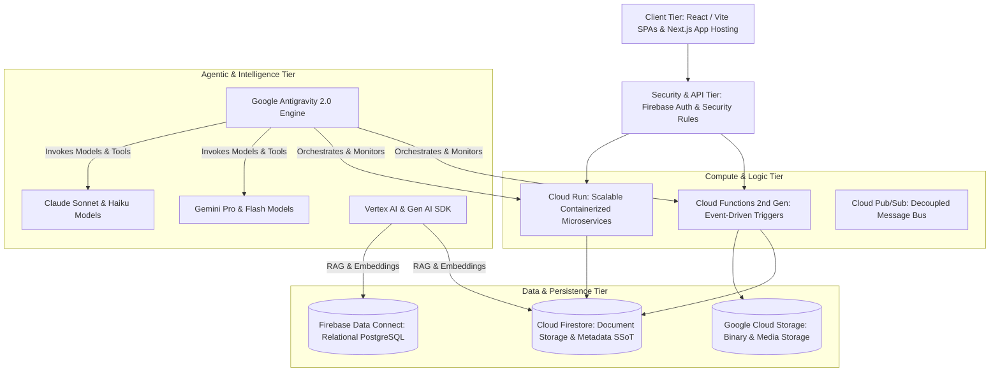
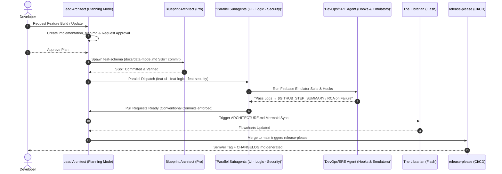
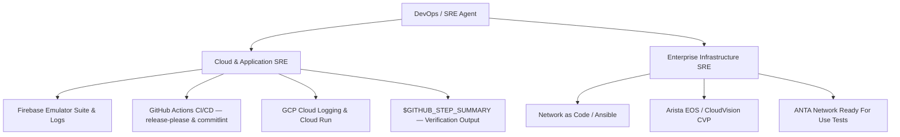
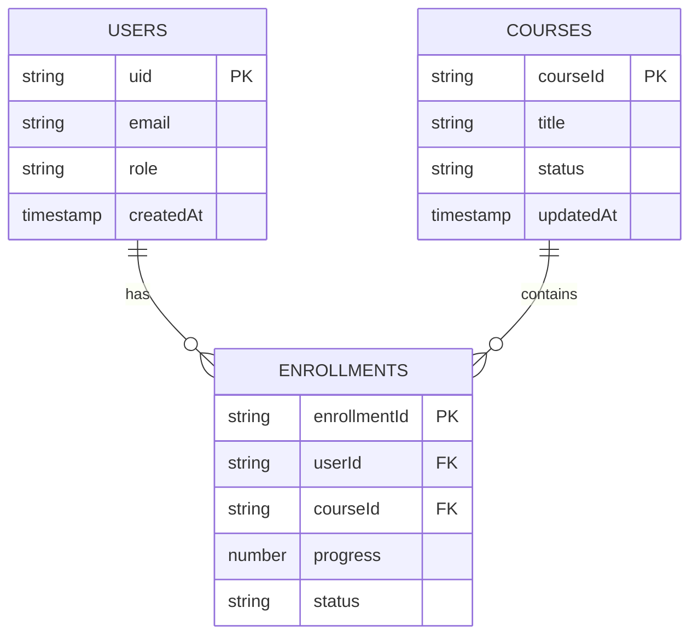

# Agentic Engineering Standard (OS 2.2) - Master Architectural & Software Design Manual

*Standard Operating Specification for Google Antigravity, Firebase, Google Cloud Platform, Gemini & Claude Agentic Engineering*

> **Supersedes**: `PARALLEL_ORCHESTRATION_WORKFLOW_OS_2.1.md` (archived as `.deprecated`)
> **Effective**: 2026-08-30 | **Version**: OS 2.2.0 | **Status**: `ACTIVE`

---

## 1. Executive Architecture & Portfolio Software Hygiene

This Master Architectural Manual defines the mandatory software design rules, operational workflows, and security guardrails for building and maintaining enterprise applications across the portfolio (*Academy Library*, *Academy Timeliner*, *Academy Builder*, *Academy Insight*, and future systems).

It establishes the **Agentic Engineering Standard (OS 2.2)** built on **Google Antigravity (AGY)** with **Gemini & Claude Agents**, transforming software development into a self-healing, event-driven, empirically-verified engineering assembly line with deterministic release hygiene.

---

### 1.1 The 7 Core Pillars of Software Hygiene

Every subagent, every PR, and every deployed artifact is bound by these seven non-negotiable pillars:

| # | Pillar | Enforcement Mechanism |
| :- | :--- | :--- |
| **1** | **Single Source of Truth (SSoT) Precedence** — Data schemas (`docs/data-model.md`) must be committed *before* consuming code is written. No application code may reference a collection, field, or type not declared in the SSoT. | Blueprint Architect gate; pre-commit hook blocks schema drift |
| **2** | **Empirical Verification Precedence** — No task, PR, or turn is declared complete without concrete, un-truncated runtime test logs or execution evidence. Screenshots or emulator pass logs must be linked in the PR body. | DevOps/SRE Agent; `$GITHUB_STEP_SUMMARY` mandatory output |
| **3** | **Zero-Symptom-Masking** — Exceptions, null payloads, or network failures must **never** be swallowed, caught silently, or replaced with dummy fallback data. Diagnostics must trace upstream root causes. `try/catch` blocks must re-throw or emit structured log entries. | `.agents/rules/software_hygiene.md`; oxlint no-swallowed-errors |
| **4** | **Least-Privilege Security** — IAM roles, Firebase Security Rules, and Secret Manager values are strictly scoped to minimum necessary access. Security rules must be validated against the local Firebase Emulator before any deploy. | The Gatekeeper; `.agents/rules/security_least_priv.md` |
| **5** | **Continuous Visual & Technical Synchronization** — Architectural flowcharts (`ARCHITECTURE.md`) are maintained dynamically via **The Librarian** background agent on every merge to `main`. | `update-docs.yml` GitHub Action; Mermaid.js auto-regeneration |
| **6** | **Domain-Driven Isolation** — Applications are partitioned into bounded contexts with clear schema interfaces. Subagents execute in isolated Git branches (`workspace: "branch"`). Zero direct commits to `main`. | `.agents/rules/data_architecture.md`; branch protection rules |
| **7** | **Deterministic Release Hygiene** — All releases follow SemVer (vX.Y.Z). `CHANGELOG.md` is generated exclusively by `release-please`. Conventional Commits 1.0.0 is mandatory for all commits. Manual edits to `CHANGELOG.md` are strictly prohibited. | `release.yml`; `lint-commits.yml`; `.agents/rules/git_conventions.md` |

---

## 2. Portfolio Technical Architecture & Google Tech Stack Standard



### 2.1 Standardized Technology Stack Matrix

| Layer | Primary Google Product | Operational Guidelines & Best Practices |
| :--- | :--- | :--- |
| **Frontend / Web Apps** | **React + Vite / Next.js (App Hosting)** | Modern Vanilla CSS / HSL tokens, ARIA accessibility, responsive layouts. No generic placeholders. TypeScript strict mode mandatory. |
| **Authentication** | **Firebase Auth** | Anonymous auth for quick starts, OAuth/Custom tokens for elevated administrative operations. |
| **Document Persistence** | **Cloud Firestore** | Hierarchical document modeling, sub-collections for historical audits (`/history`), composite index optimization. All collections declared in SSoT first. |
| **Relational Persistence** | **Firebase Data Connect** | Structured GraphQL / PostgreSQL schema definitions for complex relational domain entities. |
| **Binary Storage** | **Cloud Storage (GCS)** | Direct client uploads via Signed URLs. Automated lifecycle rules (archive blobs after 30 days). |
| **Event Compute** | **Cloud Functions (2nd Gen)** | Idempotent background triggers. Retry-safe design required. Structured error propagation mandatory. |
| **Service Microservices** | **Cloud Run** | Containerized REST / gRPC microservices scaling from 0 to N instances. |
| **Telemetry & Observability** | **Google Cloud Logging** | Structured JSON logging, central log aggregation via `google-cloud-logging` MCP. |
| **Agentic AI & LLMs** | **Google Antigravity + Gemini/Claude** | Multi-agent delegation, model tiering (Pro for reasoning, Flash for execution), tool calling, parallel workstream dispatch. |

---

## 3. Antigravity Customization Framework (`.agents/`)

Every portfolio repository instantiates a standardized `.agents/` configuration directory:

```
.agents/
├── rules/
│   ├── data_architecture.md      # Immutable rules for schema and data models (SSoT)
│   ├── security_least_priv.md    # Firebase Auth & Security least-privilege enforcement
│   ├── frontend_design.md        # UI components & design system standards
│   ├── software_hygiene.md       # Error handling, logging, and empirical test validation
│   └── git_conventions.md        # Conventional Commits 1.0.0 & release hygiene (OS 2.2 NEW)
├── skills/
│   ├── firebase-orchestrator/    # SKILL.md for Firebase CLI & Emulator tooling
│   ├── mermaid-architect/        # SKILL.md for Living Blueprint auto-generation
│   └── sre-verifier/             # SKILL.md for CI/CD log inspection & RCA
├── hooks.json                    # Lifecycle hooks: pre-commit emulator + commitlint (OS 2.2 UPDATED)
└── mcp_config.json               # MCP server definitions (Firebase, GitHub, Chrome DevTools, GCP)
```

---

## 4. Programmatic Subagent Registry & Model Tiering

| Subagent Name | Core Mission | Model Tier | Primary MCP & Tool Suites | Workspace Mode |
| :--- | :--- | :--- | :--- | :--- |
| **Blueprint Architect** | Schema design & SSoT maintenance (`docs/data-model.md`). | `Gemini Pro` / `Claude Sonnet` | Firebase MCP, Local FS | `branch` (`feat-schema`) |
| **The Gatekeeper** | Auth & Security expert. Validates all rules against local emulator before deploy. | `Gemini Pro` / `Claude Sonnet` | Firebase Security MCP, Firebase Emulator | `branch` (`feat-security`) |
| **Interface Builder** | Modular frontend development & visual UI verification. | `Gemini Pro` / `Claude Sonnet` | Chrome DevTools MCP, Modern Web Guidance | `branch` (`feat-ui`) |
| **The Logic Engine** | Idempotent Cloud Functions 2nd Gen, API routes, event triggers. | `Gemini Pro` / `Claude Sonnet` | Firebase Cloud MCP, GCP Logging MCP | `branch` (`feat-logic`) |
| **The Librarian** | Living Blueprint synchronization — regenerates Mermaid.js in `ARCHITECTURE.md` on every merge. | `Gemini Flash` / `Claude Haiku` | Mermaid Tool, Git MCP | `share` (`docs-sync`) |
| **DevOps / SRE Agent** | CI/CD management, emulator log analysis, release health, `$GITHUB_STEP_SUMMARY` output. | `Gemini Flash` / `Claude Haiku` | GitHub MCP, Cloud Run MCP, Shell Runner | `share` (`ops-main`) |

---

## 5. Master Application Workflow — 6-Phase Lifecycle



### Phase 1 — Planning Mode & Task Decomposition
- **Lead Architect** enters Antigravity **Planning Mode**.
- Generates `PROJECT_CHARTER.md` and `implementation_plan.md` with `request_feedback: true`.
- **Gate**: No code mutations begin without explicit user approval.

### Phase 2 — Structural Data Modeling & SSoT Declaration
- **Blueprint Architect** (`Pro`) establishes `docs/data-model.md`.
- All collection names, document fields, data types declared **before** consumer code exists.

### Phase 3 — Parallelized Build & MCP-Powered Delegation
- **Interface Builder**: Modular UI + Chrome DevTools MCP visual audit.
- **The Logic Engine**: Idempotent Cloud Functions. Structured error propagation — no swallowed exceptions.
- **The Gatekeeper**: Least-privilege `firestore.rules` tested against local Firebase Emulator.

### Phase 4 — Automated Verification Loop & Software Hygiene
- Pre-commit hooks: emulator suite → lint → commitlint.
- Post-edit: `oxlint --deny-warnings` runs continuously.
- All verification output posted to `$GITHUB_STEP_SUMMARY` — never committed as loose `.md` files.

### Phase 5 — Automated Visualization & Living Blueprint Sync
- **The Librarian** (`Flash`) triggers on merge events via `update-docs.yml`.
- Regenerates Mermaid.js ERD and system topology in `ARCHITECTURE.md`.

### Phase 6 — Integration, SemVer Release & Production Deployment
- `release-please` generates SemVer tags and `CHANGELOG.md` from Conventional Commits.
- Conditional production deployment on `steps.release.outputs.release_created == 'true'`.
- `walkthrough.md` artifact: change summary, emulator pass logs, visual proof screenshots.

---

## 6. Comprehensive DevOps / SRE Agent Profile

### 6.1 Dual-Domain SRE Architecture



### 6.2 Cloud & Application SRE Responsibilities
- **Guardrail & Memory Enforcement**: Monitors CPU/Memory via `manage_task`.
- **Central Log Diagnostics**: Queries GCP Cloud Logging via `google-cloud-logging` MCP.
- **Automated RCA**: Parses un-truncated tracebacks to isolate exact failure points.
- **Step Summary Reporting**: All test results and emulator logs posted to `$GITHUB_STEP_SUMMARY`.

### 6.3 Enterprise Infrastructure SRE (Optional Module)
- **Network as Code (NaC)**: Manages network device state using Ansible (`arista.avd`), Jinja2, and `cvprac`.
- **Fabric Validation**: ANTA test suites for L2/L3 topology health and BGP sessions.
- **Zero Touch Management**: ZTP and PKI/TLS certificate lifecycles.

---

## 7. SRE Metrics, Governance & Reliability Guards

### 7.1 Key Performance Indicators (KPIs)

| Metric | Definition | Target | Mechanism |
| :--- | :--- | :--- | :--- |
| **TTD** | Time from failure to diagnostic alert. | `< 30 seconds` | `manage_task` watcher |
| **TTR** | Time from detection to automated fix dispatch. | Rapid containment | Subagent auto-remediation |
| **Emulator Pass Rate** | % of PRs passing emulator suite before merge. | `100%` mandatory | `hooks.json` pre-commit |
| **Conventional Commit Rate** | % of commits passing `commitlint`. | `100%` mandatory | `lint-commits.yml` + hook |
| **Living Blueprint Sync** | Delay between schema update & `ARCHITECTURE.md` re-sync. | `< 1 min` | The Librarian + `update-docs.yml` |
| **Release Determinism** | % of releases via `release-please` only. | `100%` mandatory | `release.yml` |

### 7.2 Crucial Architectural Guards

| Guard | Rule | Enforcement |
| :--- | :--- | :--- |
| **Guard 1** | Zero direct commits to `main`. All agents execute in isolated worktrees. | Branch protection; `git_conventions.md` |
| **Guard 2** | Subagents bound by `.agents/rules/`. Cannot modify files outside domain scope. | `.agents/rules/`; system_prompt constraints |
| **Guard 3** | `docs/data-model.md` committed before consuming application code. | Blueprint Architect gate |
| **Guard 4** | No task complete without `$GITHUB_STEP_SUMMARY` evidence. | DevOps/SRE Agent; CI Step Summary |
| **Guard 5** *(OS 2.2 NEW)* | `CHANGELOG.md` generated solely by `release-please`. No manual edits. | `release.yml`; `git_conventions.md` |

---

## 8. Living Blueprint Protocol

`ARCHITECTURE.md` is maintained dynamically by **The Librarian** agent using auto-generated Mermaid.js blocks:



Every merge to `main` triggers `update-docs.yml`, ensuring documentation matches the running production state at all times.

---

## 9. Release & Versioning Protocol (OS 2.2 Addition)

### 9.1 SemVer Tagging via `release-please`
- `fix:` → **PATCH** (e.g., `v1.0.1`)
- `feat:` → **MINOR** (e.g., `v1.1.0`)
- `feat!:` or `BREAKING CHANGE:` footer → **MAJOR** (e.g., `v2.0.0`)

### 9.2 CHANGELOG.md Governance
- `CHANGELOG.md` is **read-only for all humans and agents**.
- Generated exclusively by `release-please` on merge to `main`.
- PRs containing manual edits to `CHANGELOG.md` are automatically rejected.

### 9.3 Agent Attribution in Commits
All commits authored by subagents must include:
```
Co-authored-by: <AgentName> <agent@antigravity.internal>
```

---

## 10. Conclusion: The Autonomous Enterprise Ecosystem

**OS 2.2 vs OS 2.1 Key Upgrades:**

| Dimension | OS 2.1 | OS 2.2 |
| :--- | :--- | :--- |
| Release hygiene | Manual | `release-please` SemVer automation |
| Commit standards | Recommended | Mandatory — `commitlint` in `pre-commit` |
| Agent models | Gemini only | Gemini + Claude (tiered) |
| Verification output | Loose `.md` files | `$GITHUB_STEP_SUMMARY` only |
| Core Pillars | 6 | **7** (+ Deterministic Release Hygiene) |
| `CHANGELOG.md` | Human-editable | Machine-generated only (`release-please`) |
