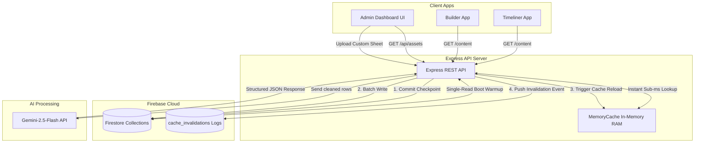
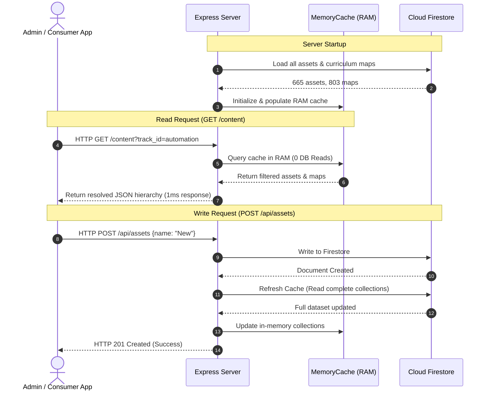
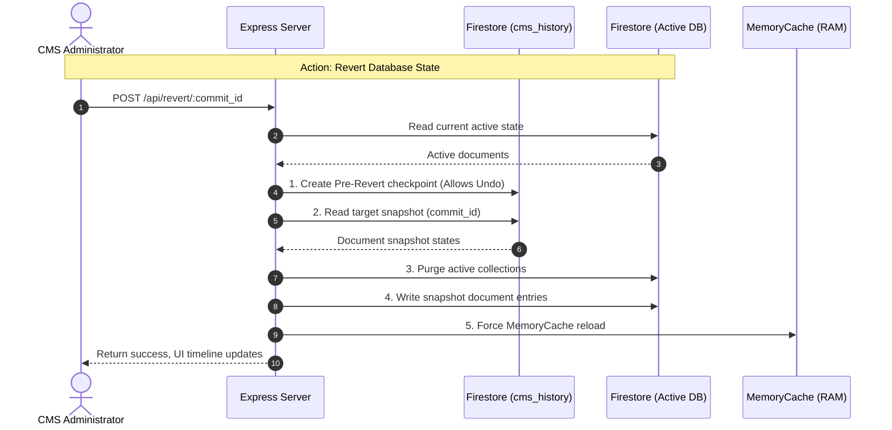

# Architecture Blueprint: Academy Builder

This document outlines the visual system architecture, processing flows, caching strategies, and recommendation engines for the Academy Builder application.

---

## 1. System Topology & Data Flow

---

## 2. In-Memory Cache Optimization

To eliminate database read quotas entirely and deliver sub-millisecond response times for external API clients, the application implements an in-memory caching system:

---

## 3. Database Checkpoint Snapshot & Rollback Sequence

To protect curriculum mapping integrity and provide an administrative "undo" history, the system operates as follows:

