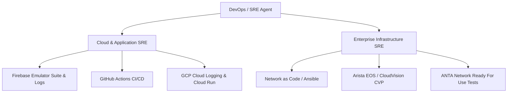
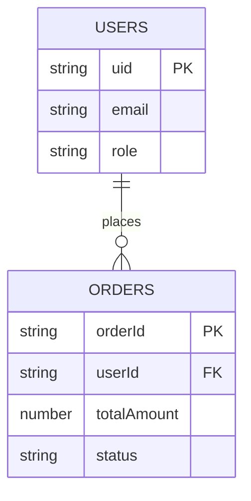

# **Parallel Orchestration Workflow (OS 2.1) - Master Architectural Manual**
*Optimized for Google Antigravity (AGY) & Gemini Agentic Framework*

---

## **1. Executive Architecture & Antigravity Setup**

This Standard Operating Procedure (SOP) defines the mandatory steps for executing the Master Application Workflow using **Google Antigravity (AGY)** and **Gemini Agents**. It transforms multi-agent development from manual text prompting into an autonomous, event-driven, parallel engineering system.

### **1.1 Workspace Customization Setup (`.agents/`)**

Every repository operating on OS 2.1 must instantiate an `.agents/` configuration directory to establish declarative boundaries and skills across all subagents:

```
.agents/
├── rules/
│   ├── data_architecture.md    # Immutable rules for schema and data models
│   ├── security_least_priv.md  # Firebase Auth & Security least-privilege enforcement
│   └── frontend_design.md      # UI components & design system standards
├── skills/
│   ├── firebase-orchestrator/  # SKILL.md for Firebase CLI & Emulator tooling
│   ├── mermaid-architect/      # SKILL.md for Living Blueprint auto-generation
│   └── sre-verifier/           # SKILL.md for CI/CD log inspection & RCA
├── hooks.json                  # Lifecycle hooks for pre-commit emulator verification
└── mcp_config.json             # MCP server definitions (Firebase, GitHub, Chrome DevTools)
```

### **1.2 Master Build-Out Checklist**

1. **Antigravity Workspace Configured**: `.agents/` rules, skills, and `hooks.json` initialized.
2. **Project Charter & Planning Artifact Published**: `PROJECT_CHARTER.md` and `implementation_plan.md` generated with `request_feedback: true`.
3. **MCP Servers Activated**: Firebase MCP, GitHub MCP, and Chrome DevTools MCP registered.
4. **Schema Definition**: `docs/data-model.md` published as the single source of truth (SSoT).
5. **Parallel Workstream Subagents Spawned**: Subagents invoked in isolated branched workspaces (`workspace: "branch"`).
6. **Emulator & Automated Verification**: Local Firebase Emulator suite checks enforced via AGY lifecycle hooks.
7. **Living Architecture File**: `ARCHITECTURE.md` auto-updated with Mermaid.js flowcharts via Gemini Flash subagents.
8. **Automated Walkthrough & PR Review**: `walkthrough.md` generated with test logs and UI screenshot proofs.
9. **Final CI/CD Deployment**: Deployed via DevOps/SRE Agent to production.

---

## **2. Specialized Gemini Subagent Registry**

Antigravity orchestrates workstreams using heterogeneous model assignment to optimize for reasoning capability, throughput, and speed.

| Subagent Name | Core Mission | Gemini Model Tier | Primary MCP & Tool Suites | AGY Workspace Mode |
| :--- | :--- | :--- | :--- | :--- |
| **Blueprint Architect** | Schema design & SSoT maintenance (`docs/data-model.md`). | `Gemini 3.5/3.6 Pro` | Firebase MCP, Local FS | `branch` (`feat-schema`) |
| **The Gatekeeper** | Auth & Security expert. Enforces least-privilege rules. | `Gemini 3.5/3.6 Pro` | Firebase Security MCP, Firebase Emulator | `branch` (`feat-security`) |
| **Interface Builder** | Modular frontend development & visual UI verification. | `Gemini 3.5/3.6 Pro` | Chrome DevTools MCP, Modern Web Guidance | `branch` (`feat-ui`) |
| **The Logic Engine** | Idempotent Cloud Functions, API routes, and triggers. | `Gemini 3.5/3.6 Pro` | Firebase Cloud MCP, GCP Logging MCP | `branch` (`feat-logic`) |
| **The Librarian** | Living Blueprint synchronization (`ARCHITECTURE.md`). | `Gemini 3.5/3.6 Flash` | Mermaid Tool, Git MCP | `share` (`docs-sync`) |
| **DevOps / SRE Agent** | CI/CD management, Emulator log analysis, and release health. | `Gemini 3.5/3.6 Flash` | GitHub MCP, Cloud Run MCP, Shell Runner | `share` (`ops-main`) |

---

## **3. Programmatic Antigravity Subagent Definitions**

Parent agents programmatically define subagents using `define_subagent` and invoke them concurrently:

```json
{
  "name": "BlueprintArchitect",
  "description": "Data Architect subagent responsible for schema design and SSoT integrity",
  "system_prompt": "Act as the Data Architect. Your single source of truth is docs/data-model.md. Maintain schema definitions and Firestore structure using Firebase tools.",
  "enable_write_tools": true,
  "enable_mcp_tools": true
}
```

```json
{
  "name": "TheGatekeeper",
  "description": "Security Engineer subagent responsible for auth and least-privilege security rules",
  "system_prompt": "Act as a Security Engineer. Enforce least-privilege rules in firestore.rules. Validate all rules against the local Firebase emulator before committing.",
  "enable_write_tools": true,
  "enable_mcp_tools": true
}
```

### **Antigravity Start-Up Execution (Python SDK / CLI)**

For programmatic orchestration using the `google-antigravity` Python SDK:

```python
import asyncio
from google.antigravity import Agent, LocalAgentConfig, CapabilitiesConfig

async def initialize_project_orchestration():
    config = LocalAgentConfig(
        system_instructions="Act as the Lead Architect for OS 2.1. Decompose features into parallel workstreams, initialize .agents rules, and spawn specialized subagents.",
        capabilities=CapabilitiesConfig(allow_shell=True, allow_fs_write=True)
    )
    async with Agent(config) as lead_architect:
        response = await lead_architect.chat("Initialize repository structure, create implementation_plan.md, and launch parallel subagents for Data Foundation and Authentication.")
        async for token in response:
            print(token, end="")

if __name__ == "__main__":
    asyncio.run(initialize_project_orchestration())
```

---

## **4. The Master Application Workflow Phases**

### **Phase 1: Planning Mode & Parallel Task Decomposition**
* **Lead Architect** enters Antigravity **Planning Mode**.
* Generates `PROJECT_CHARTER.md` and `implementation_plan.md`.
* Defines workstreams and invokes parallel subagents (`invoke_subagent`) with isolated git branches (`feat-schema`, `feat-auth`, `feat-ui`).
* Requires explicit user review on `implementation_plan.md` before execution.

### **Phase 2: Structural Data Modeling & SSoT Declaration**
* **Blueprint Architect** (`Gemini Pro`) establishes `docs/data-model.md`.
* All schema changes are committed to SSoT *before* frontend or backend agents consume data types.
* Immutable contract pattern prevents "architectural drift".

### **Phase 3: Parallelized Build & MCP-Powered Delegation**
* Concurrent execution across subagents:
  * **Interface Builder** builds UI components and verifies them visually using `chrome-devtools-mcp` (taking DOM snapshots, color contrast, and tap target audits).
  * **The Logic Engine** writes idempotent Cloud Functions and tests endpoints.
  * **The Gatekeeper** writes security rules and validates against `firebase_firestore` emulator.

### **Phase 4: Automated Verification Loop & Lifecycle Hooks**
* Enforces `hooks.json` pre-commit checks:
  * Automatically executes `firebase emulators:exec "npm test"` before any pull request.
* In the event of a failure, the SRE Agent captures full log tracebacks natively without swallowing exceptions or using dummy fallbacks.
* Generates an automated Root Cause Analysis (RCA).

### **Phase 5: Automated Visualization & Living Blueprint Sync**
* **The Librarian** (`Gemini Flash`) triggers on git commit events.
* Parses `docs/data-model.md` and `firestore.rules` to regenerate Mermaid.js diagrams in `ARCHITECTURE.md`.
* Runs as a background task using AGY `schedule` cron or post-merge GitHub Action (`update-docs.yml`).

### **Phase 6: Integration, Walkthrough & Production Deployment**
* SRE Agent runs full integration test suite.
* Generates `walkthrough.md` artifact containing:
  * Summary of changes across workstreams.
  * Verification logs from emulator suite.
  * Visual proof screenshots from Chrome DevTools MCP.
* Prompts Lead Architect for final deployment approval to production (`PRODUCTION_URL`).

---

## **5. Comprehensive DevOps / SRE Agent Profile**

The DevOps/SRE Agent is the custodian of system reliability, operational telemetry, and CI/CD pipelines.

### **5.1 Dual-Domain SRE Architecture**



### **5.2 Cloud & Application SRE Responsibilities**
* **Guardrail Enforcement**: Monitors memory/CPU consumption of local emulators and background tasks (`manage_task`).
* **Telemetry & Logging**: Queries GCP Cloud Logging via `google-cloud-logging` MCP to detect runtime exceptions.
* **Automated RCA**: Parses un-truncated tracebacks upon pipeline failures to generate actionable root cause diagnostics.

### **5.3 Enterprise Infrastructure SRE Responsibilities (Optional Module)**
* **Network as Code (NaC)**: Manages network device state using Ansible collections (`arista.avd`), Jinja2 templates, and `cvprac`.
* **Fabric Validation**: Executes ANTA test suites to verify L2/L3 topology health and BGP sessions.
* **Zero Touch Management**: Handles Zero Touch Provisioning (ZTP) and PKI/TLS certificate lifecycles.

---

## **6. SRE Metrics, Governance & Reliability Guards**

### **6.1 Key Performance Indicators (KPIs)**

| Metric | Definition | SRE Objective | Antigravity Mechanism |
| :--- | :--- | :--- | :--- |
| **Time to Detection (TTD)** | Time from failure to alert. | `< 30 seconds` | Background task watcher (`manage_task`) |
| **Response Velocity (TTR)** | Time from detection to automated fix. | Rapid containment | Subagent auto-remediation loop |
| **Emulator Test Pass Rate** | % of PRs passing local emulation. | `100% mandatory` | Pre-commit lifecycle hook (`hooks.json`) |
| **Living Blueprint Sync** | Delay between schema change & `ARCHITECTURE.md` update. | Real-time (`< 1 min`) | `The Librarian` subagent trigger (`Gemini Flash`) |

### **6.2 Crucial Architectural Guards**

* **Guard 1: Isolated Workstream Branching**: Zero direct commits to `main`. All agents work in isolated worktrees (`workspace: "branch"`).
* **Guard 2: Declarative Rule Precedence**: Subagent instructions are bound by `.agents/rules/`. Subagents cannot alter files outside their scope.
* **Guard 3: SSoT First-Mutation Rule**: Schema changes in `docs/data-model.md` must be committed *before* consuming code is written.
* **Guard 4: Empirical Verification Rule**: No turn or task is marked complete without concrete, empirical test logs or execution output.

---

## **7. Living Blueprint Protocol**

`ARCHITECTURE.md` is maintained dynamically by **The Librarian** agent using auto-generated Mermaid.js blocks:



Every merge to `main` executes `update-docs.yml`, keeping system diagrams accurate and eliminating documentation drift.

---

## **8. Conclusion: The Autonomous Enterprise Ecosystem**

By upgrading the **Parallel Orchestration Workflow (OS 2.1)** with **Google Antigravity** and **Gemini Agents**, development teams transition from fragmented manual prompting to a disciplined, self-healing, parallel software assembly line. Through native subagents, model tiering, MCP integration, and automated verification loops, OS 2.1 delivers unprecedented developer velocity while maintaining strict architectural stability.
