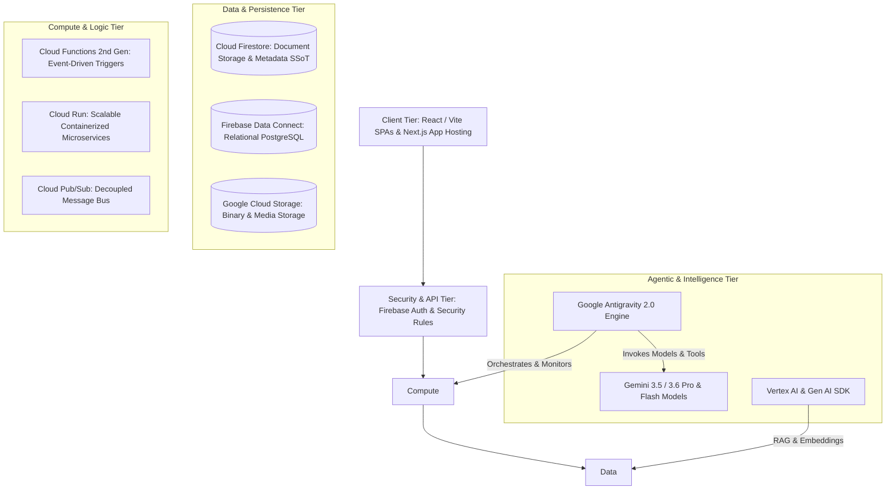
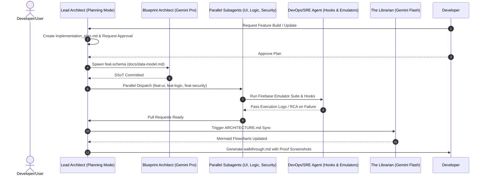
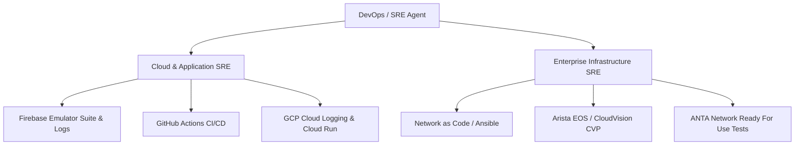
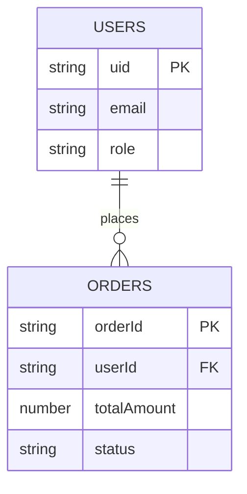

# **Parallel Orchestration Workflow (OS 2.1) - Master Architectural & Software Design Manual**
*Standard Operating Specification for Google Antigravity, Firebase, Google Cloud Platform & Gemini Agentic Engineering*

---

## **1. Executive Architecture & Portfolio Software Hygiene**

This Master Architectural Manual defines the mandatory software design rules, operational workflows, and security guardrails for building and maintaining enterprise applications across the portfolio (*Academy Library*, *Academy Timeliner*, *Academy Builder*, *Academy Insight*, and future systems).

It establishes an **Architectural Operating System (OS 2.1)** built on **Google Antigravity (AGY)** and **Gemini Agents**, transforming software development into a self-healing, event-driven, parallel engineering assembly line.

### **1.1 The Core Pillars of Software Hygiene**

1. **Domain-Driven Isolation**: Applications are partitioned into bounded contexts with clear schema interfaces.
2. **Single Source of Truth (SSoT) Precedence**: Data schemas (`docs/data-model.md`) must be committed *before* consuming code is written.
3. **Empirical Verification Precedence**: No task or PR is declared complete without concrete, un-truncated runtime test logs or execution evidence.
4. **Zero-Symptom-Masking Rule**: Exceptions, null payloads, or network failures must never be swallowed or replaced with dummy fallbacks. Diagnostics must trace upstream root causes.
5. **Least-Privilege Security**: IAM roles, Firebase Security Rules, and Secret Manager values are strictly scoped to minimum necessary access.
6. **Continuous Visual & Technical Synchronization**: Architectural flowcharts (`ARCHITECTURE.md`) are maintained dynamically via background agents.

---

## **2. Portfolio Technical Architecture & Google Tech Stack Standard**



### **2.1 Standardized Technology Stack Matrix**

| Layer | Primary Google Product | Operational Guidelines & Best Practices |
| :--- | :--- | :--- |
| **Frontend / Web Apps** | **React + Vite / Next.js (App Hosting)** | Modern Vanilla CSS / HSL tokens, ARIA accessibility, responsive layouts. No generic placeholders. |
| **Authentication** | **Firebase Auth** | Anonymous auth for quick starts, OAuth/Custom tokens for elevated administrative operations. |
| **Document Persistence** | **Cloud Firestore** | Hierarchical document modeling, sub-collections for historical audits (`/history`), composite index optimization. |
| **Relational Persistence** | **Firebase Data Connect** | Structured GraphQL / PostgreSQL schema definitions for complex relational domain entities. |
| **Binary Storage** | **Cloud Storage (GCS)** | Direct client uploads via Signed URLs. Automated lifecycle rules (transitioning archive blobs after 30 days). |
| **Event Compute** | **Cloud Functions (2nd Gen)** | Idempotent background triggers responding to GCS uploads, Firestore events, and Pub/Sub topics. |
| **Service Microservices** | **Cloud Run** | Containerized REST / gRPC microservices scaling automatically from 0 to N instances. |
| **Telemetry & Observability** | **Google Cloud Logging** | Structured JSON logging, central log aggregation via `google-cloud-logging` MCP tool. |
| **Agentic AI & LLMs** | **Google Antigravity & Gemini 3.5/3.6** | Multi-agent delegation, model tiering (`Pro` for reasoning, `Flash` for execution speed), tool calling. |

---

## **3. Antigravity Customization Framework (`.agents/`)**

Every portfolio repository must instantiate a standardized `.agents/` configuration directory to establish declarative boundaries and skills across all subagents:

```
.agents/
├── rules/
│   ├── data_architecture.md    # Immutable rules for schema and data models
│   ├── security_least_priv.md  # Firebase Auth & Security least-privilege enforcement
│   ├── frontend_design.md      # UI components & design system standards
│   └── software_hygiene.md     # Error handling, logging, and test validation rules
├── skills/
│   ├── firebase-orchestrator/  # SKILL.md for Firebase CLI & Emulator tooling
│   ├── mermaid-architect/      # SKILL.md for Living Blueprint auto-generation
│   └── sre-verifier/           # SKILL.md for CI/CD log inspection & RCA
├── hooks.json                  # Lifecycle hooks for pre-commit emulator verification
└── mcp_config.json             # MCP server definitions (Firebase, GitHub, Chrome DevTools, GCP)
```

### **3.1 Automated Lifecycle Hooks (`hooks.json`)**

Pre-commit and post-edit hooks automatically enforce software hygiene prior to git commits:

```json
{
  "hooks": {
    "pre-commit": [
      "firebase emulators:exec --only firestore,functions 'npm test'",
      "npm run lint"
    ],
    "post-edit": [
      "npx oxlint --deny-warnings"
    ]
  }
}
```

---

## **4. Programmatic Gemini Subagent Registry & Model Tiering**

Antigravity orchestrates workstreams using heterogeneous model assignment to optimize for reasoning capability, throughput, and execution speed.

| Subagent Name | Core Mission | Gemini Model Tier | Primary MCP & Tool Suites | Workspace Mode |
| :--- | :--- | :--- | :--- | :--- |
| **Blueprint Architect** | Schema design & SSoT maintenance (`docs/data-model.md`). | `Gemini 3.5/3.6 Pro` | Firebase MCP, Local FS | `branch` (`feat-schema`) |
| **The Gatekeeper** | Auth & Security expert. Enforces least-privilege rules. | `Gemini 3.5/3.6 Pro` | Firebase Security MCP, Firebase Emulator | `branch` (`feat-security`) |
| **Interface Builder** | Modular frontend development & visual UI verification. | `Gemini 3.5/3.6 Pro` | Chrome DevTools MCP, Modern Web Guidance | `branch` (`feat-ui`) |
| **The Logic Engine** | Idempotent Cloud Functions, API routes, and triggers. | `Gemini 3.5/3.6 Pro` | Firebase Cloud MCP, GCP Logging MCP | `branch` (`feat-logic`) |
| **The Librarian** | Living Blueprint synchronization (`ARCHITECTURE.md`). | `Gemini 3.5/3.6 Flash` | Mermaid Tool, Git MCP | `share` (`docs-sync`) |
| **DevOps / SRE Agent** | CI/CD management, Emulator log analysis, and release health. | `Gemini 3.5/3.6 Flash` | GitHub MCP, Cloud Run MCP, Shell Runner | `share` (`ops-main`) |

### **4.1 Programmatic Subagent Definitions (`define_subagent`)**

Parent agents programmatically define and invoke subagents concurrently:

```json
{
  "name": "BlueprintArchitect",
  "description": "Data Architect subagent responsible for schema design and SSoT integrity",
  "system_prompt": "Act as the Data Architect. Your single source of truth is docs/data-model.md. Maintain schema definitions and Firestore structure using Firebase tools.",
  "enable_write_tools": true,
  "enable_mcp_tools": true
}
```

```json
{
  "name": "TheGatekeeper",
  "description": "Security Engineer subagent responsible for auth and least-privilege security rules",
  "system_prompt": "Act as a Security Engineer. Enforce least-privilege rules in firestore.rules. Validate all rules against the local Firebase emulator before committing.",
  "enable_write_tools": true,
  "enable_mcp_tools": true
}
```

### **4.2 Python SDK Orchestration (`google-antigravity`)**

For programmatic agent leasing inside scripts or test suites:

```python
import asyncio
from google.antigravity import Agent, LocalAgentConfig, CapabilitiesConfig

async def run_portfolio_orchestration():
    config = LocalAgentConfig(
        system_instructions="Act as the Lead Architect for OS 2.1. Decompose features into parallel workstreams, initialize .agents rules, and spawn specialized subagents.",
        capabilities=CapabilitiesConfig(allow_shell=True, allow_fs_write=True)
    )
    async with Agent(config) as lead_architect:
        response = await lead_architect.chat("Initialize repository structure, create implementation_plan.md, and launch parallel subagents for Data Foundation and Authentication.")
        async for token in response:
            print(token, end="")

if __name__ == "__main__":
    asyncio.run(run_portfolio_orchestration())
```

---

## **5. Master Application Workflow Phases**



### **Phase 1: Planning Mode & Task Decomposition**
* **Lead Architect** enters Antigravity **Planning Mode**.
* Generates `PROJECT_CHARTER.md` and `implementation_plan.md` with explicit feedback flags (`request_feedback: true`).
* Requires user approval before code mutations begin.

### **Phase 2: Structural Data Modeling & SSoT Declaration**
* **Blueprint Architect** (`Gemini Pro`) establishes `docs/data-model.md`.
* All collection names, document fields, and data types are declared and committed prior to consumer code development.

### **Phase 3: Parallelized Build & MCP-Powered Delegation**
* Concurrent workstream execution in isolated Git branches (`workspace: "branch"`):
  * **Interface Builder**: Builds modular UI components and visually audits layout via `chrome-devtools-mcp` (DOM snapshots, contrast, tap target sizing).
  * **The Logic Engine**: Writes idempotent Cloud Functions (2nd Gen) and validates endpoints.
  * **The Gatekeeper**: Enforces least-privilege security rules (`firestore.rules`) and tests against local Firestore Emulator.

### **Phase 4: Automated Verification Loop & Software Hygiene**
* Pre-commit hooks (`hooks.json`) automatically execute emulator test suites.
* If a failure occurs, the SRE Agent extracts full log tracebacks without masking errors or substituting mock stubs.
* Performs automated Root Cause Analysis (RCA).

### **Phase 5: Automated Visualization & Living Blueprint Sync**
* **The Librarian** (`Gemini Flash`) triggers on git merge events.
* Regenerates Mermaid.js ERD and system topology flowcharts in `ARCHITECTURE.md`.
* Automated via GitHub Action (`update-docs.yml`).

### **Phase 6: Integration, Walkthrough & Production Deployment**
* SRE Agent executes end-to-end integration tests.
* Generates `walkthrough.md` artifact containing:
  * Summary of changes across workstreams.
  * Verification logs from Firebase Emulator suite.
  * Visual proof screenshots from Chrome DevTools MCP.
* Deploys application to production URL (`PRODUCTION_URL`).

---

## **6. Comprehensive DevOps / SRE Agent Profile**

The DevOps/SRE Agent is the custodian of system reliability, operational telemetry, CI/CD pipelines, and software hygiene.

### **6.1 Dual-Domain SRE Architecture**



### **6.2 Cloud & Application SRE Responsibilities**
* **Guardrail & Memory Enforcement**: Monitors CPU/Memory utilization of background processes using `manage_task`.
* **Central Log Diagnostics**: Queries GCP Cloud Logging via `google-cloud-logging` MCP to capture live stack traces.
* **Automated RCA**: Parses un-truncated tracebacks to isolate exact failure points without manual intervention.

### **6.3 Enterprise Infrastructure SRE Responsibilities (Optional Module)**
* **Network as Code (NaC)**: Manages network device state using Ansible collections (`arista.avd`), Jinja2 templates, and `cvprac`.
* **Fabric Validation**: Executes ANTA test suites to verify L2/L3 topology health and BGP sessions.
* **Zero Touch Management**: Handles Zero Touch Provisioning (ZTP) and PKI/TLS certificate lifecycles.

---

## **7. SRE Metrics, Governance & Reliability Guards**

### **7.1 Key Performance Indicators (KPIs)**

| Metric | Definition | Target Objective | Antigravity Engine Mechanism |
| :--- | :--- | :--- | :--- |
| **Time to Detection (TTD)** | Time from failure to diagnostic alert. | `< 30 seconds` | Background task watcher (`manage_task`) |
| **Response Velocity (TTR)** | Time from detection to automated fix. | Rapid containment | Subagent auto-remediation loop |
| **Emulator Test Pass Rate** | % of PRs passing local emulator suite. | `100% mandatory` | Pre-commit lifecycle hook (`hooks.json`) |
| **Living Blueprint Sync** | Delay between schema update & `ARCHITECTURE.md` sync. | Real-time (`< 1 min`) | `The Librarian` subagent (`Gemini Flash`) |

### **7.2 Crucial Architectural Guards**

* **Guard 1: Isolated Workstream Branching**: Zero direct commits to `main`. All agents execute in isolated worktrees (`workspace: "branch"`).
* **Guard 2: Declarative Rule Precedence**: Subagent instructions are bound by `.agents/rules/`. Subagents cannot modify files outside their domain scope.
* **Guard 3: SSoT First-Mutation Rule**: Schema declarations in `docs/data-model.md` must be committed *before* consuming application code is written.
* **Guard 4: Empirical Verification Rule**: No turn or task is marked complete without concrete, un-truncated test logs or execution output.

---

## **8. Living Blueprint Protocol**

`ARCHITECTURE.md` is maintained dynamically by **The Librarian** agent using auto-generated Mermaid.js blocks:



Every merge to `main` triggers `update-docs.yml`, ensuring documentation matches running production state at all times.

---

## **9. Conclusion: The Autonomous Enterprise Ecosystem**

By enforcing the **Parallel Orchestration Workflow (OS 2.1)** across all applications, development teams operate a unified, high-performance software assembly line. Leveraging **Google Antigravity**, **Firebase**, **Google Cloud Platform**, and **Gemini Agents**, portfolio applications achieve rapid developer velocity, empirical software hygiene, and robust architectural stability.
