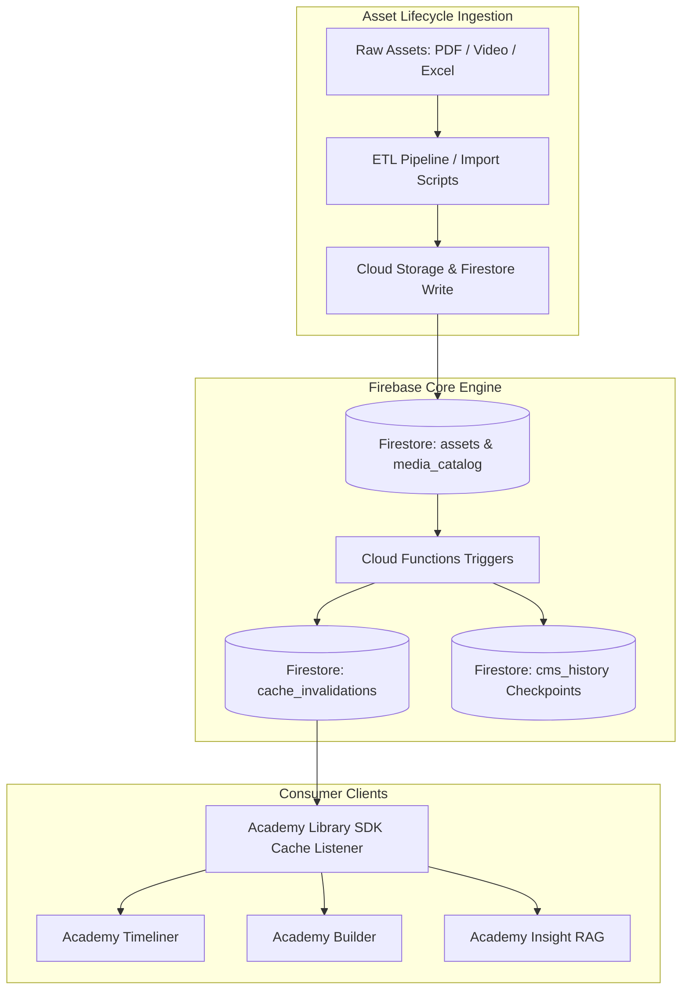
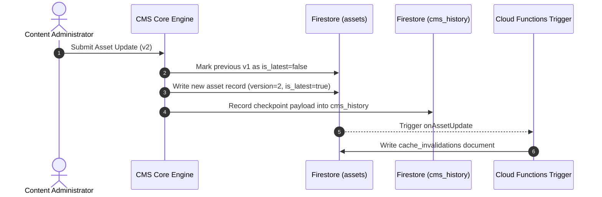

# Academy Library: CMS & Asset Lifecycle Architecture Specification

This document defines the architecture, data structures, versioning rules, ingestion pipelines, and event-driven lifecycle management for the **Academy Library** Digital Asset Management (DAM) system and Content Management System (CMS).

---

## 1. Executive Summary & System Overview

`Academy Library` provides a unified, single-source-of-truth metadata repository and digital asset lifecycle engine for the entire **academy-live-builder** multi-site ecosystem:

* **Academy Timeliner**: Queries course asset timelines and dependency structures.
* **Academy Builder**: Composes learning paths and integrates interactive track modules.
* **Academy Insight**: Performs RAG vector searches and retrieves document chunks.
* **Academy Library Portal**: Manages direct asset uploads, metadata tagging, and lifecycle versioning.

The asset management core is powered by Google Cloud Storage and Firebase Firestore (`academy-live-db`), orchestrated with event-driven Firebase Cloud Functions v2 and a custom SDK for edge-cached client consumption.



---

## 2. Asset Lifecycle Stages

The asset lifecycle consists of five distinct phases from creation to distribution and invalidation:

### Stage 1: Ingestion & Metadata Extraction
* **Sources**: Course manuals, slide decks, lab topologies (PDFs), video modules, and structured track spreadsheets (`Academy CMS Master 1.xlsx`).
* **Normalization**: Assets are slugified into deterministic document IDs (`asset_id`) (e.g. `why-cloudvision`).
* **Validation**: Required fields (`name`, `type`, `attributes`) are validated prior to Firestore commit.

### Stage 2: Storage & Media Catalog Routing
* **Storage Uri**: Assets are saved to Firebase Storage under organized buckets with corresponding `gcs_uri` identifiers (e.g. `gs://academy-live-builder.appspot.com/assets/...`).
* **Secure Access**: Download tokens generate `attributes.url` values for secure HTTP client downloads.
* **Media Cataloging**: Large files produce entries in `media_catalog` with extracted MIME types, sizes, and study duration metrics.

### Stage 3: Versioning & Checkpoint History
* **Active Version Tracking**: Each asset maintains an incremental integer `version` field (defaulting to `1`) and a boolean `is_latest` flag.
* **Non-Destructive Updates**: Updating an asset creates a version increment or modifies metadata while preserving historical references.
* **CMS Checkpoints**: Operational state snapshots are captured in `cms_history`, recording ISO 8601 timestamps, author identifiers, change descriptions, and complete state copies for rollback capability.



### Stage 4: Event-Driven Cache Invalidation
* **Trigger Functions**: Cloud Functions (`onAssetUpdate` and `onCurriculumWrite`) monitor mutations on `assets/{assetId}` and `curriculum_map/{mapId}`.
* **Invalidation Event Generation**: When changes occur, the function writes an event payload to `cache_invalidations` with the modified document ID, change type (`create`, `update`, `delete`), timestamp, and delta summary.

### Stage 5: Client Synchronization & SDK Consumption
* **SDK Listener**: The `AcademyLibrarySDK` maintains an active snapshot listener on `cache_invalidations`.
* **Selective Invalidation**: Upon receiving an invalidation event, client-side cached assets or curriculum mappings are evicted and refetched.
* **Fallback API**: REST service handlers (`api/server.js`) deliver edge-compatible JSON responses for non-Node clients.

---

## 3. Core Database Schemas & Data Contracts

### 3.1 Collection: `assets`
Stores normalized, unique, and versioned asset metadata.

```json
{
  "asset_id": "why-cloudvision",
  "name": "Why CloudVision?",
  "type": "video",
  "version": 1,
  "is_latest": true,
  "attributes": {
    "duration": 15,
    "prerequisite": "network-foundations-101",
    "difficulty_level": 2.5,
    "skill_tags": ["NetOps", "CV"],
    "last_updated": "2026-08-01",
    "comments": "Core introductory video module",
    "topic": "Network Automation Overview",
    "url": "https://firebasestorage.googleapis.com/v0/b/academy-live-builder.appspot.com/o/assets%2Fwhy-cv.mp4?alt=media",
    "gcs_uri": "gs://academy-live-builder.appspot.com/assets/why-cv.mp4"
  }
}
```

### 3.2 Collection: `curriculum_map`
Maintains structural track hierarchies and asset sequence order.

```json
{
  "id": "cm_auto_101",
  "track_id": "automation",
  "track_name": "Automation",
  "sub_track": "Automation Fundamentals",
  "lesson": "Automation & NetOps Foundation",
  "topic": "Network Automation Overview",
  "asset_ref": "/assets/why-cloudvision",
  "version": 1,
  "is_latest": true,
  "sorting": {
    "track_number": 4,
    "sub_track_number": 1,
    "lesson_number": 1,
    "topic_number": 1,
    "sub_topic_number": 1
  }
}
```

### 3.3 Collection: `cms_history`
Audit and database checkpoint history for system rollbacks.

```json
{
  "id": "chk_20260806_001",
  "timestamp": "2026-08-06T08:30:00.000Z",
  "author": "Admin User",
  "description": "Updated CloudVision course assets and curriculum track ordering",
  "state": {
    "assets_count": 142,
    "curriculum_nodes_count": 88
  }
}
```

### 3.4 Collection: `cache_invalidations`
Real-time change notification collection listened to by the consumer SDK.

```json
{
  "id": "inv_992123",
  "type": "asset_update",
  "doc_id": "why-cloudvision",
  "change_type": "update",
  "timestamp": "2026-08-06T08:59:00.000Z",
  "details": {
    "name": "Why CloudVision?",
    "changes": ["attributes.duration", "attributes.difficulty_level"]
  }
}
```

---

## 4. API & SDK Integration Standard

The `AcademyLibrarySDK` provides standard interfaces for consuming applications:

```javascript
const { AcademyLibrarySDK } = require('@academy/library-sdk');

const sdk = new AcademyLibrarySDK({
  apiBaseUrl: 'http://localhost:8082',
  projectId: 'academy-live-builder'
});

// Fetch active curriculum for a track
const curriculum = await sdk.getTrackCurriculum('automation');

// Subscribe to real-time cache invalidations
sdk.listenForInvalidations((event) => {
  console.log(`Cache invalidated for ${event.type}: ${event.doc_id}`);
});
```

---

## 5. Security & Multi-Site Governance

1. **Role-Based Access Control (RBAC)**:
   * **Read Access**: Open across all verified consumer applications (*Timeliner*, *Builder*, *Insight*).
   * **Write/Delete Access**: Restricted strictly to authorized Curriculum Managers via Firebase Auth claims.
2. **Referential Integrity**:
   * `curriculum_map.asset_ref` pointers are enforced using Firestore `DocumentReference` types.
   * Cascade checks prevent deleting active `assets` documents referenced by live curriculum nodes.
3. **Data Loss Prevention**:
   * All bulk ingestion scripts must generate a `cms_history` checkpoint prior to writing updates.
